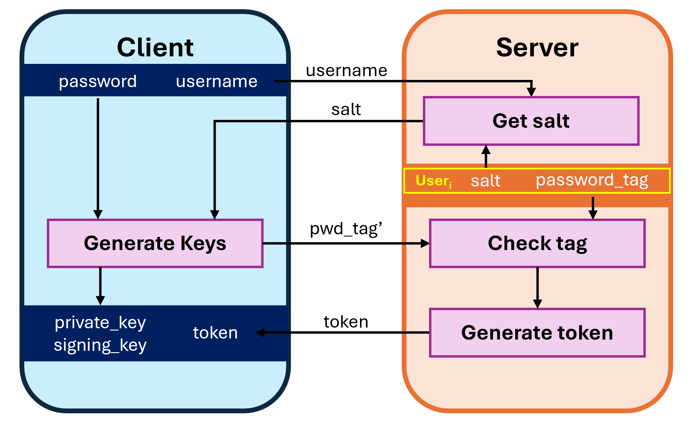

<h1 style="text-align: center; font-size: 24pt">ICR : Mini-Projet</h1>
<h2 style="text-align: center; font-size: 18pt">Rapport</h2>
<h2 style="text-align: center; font-size: 18pt">Loïc Piccot - 21.05.2025</h2>

---

# Introduction
## Objectifs

Ce projet a pour objectif d'implémenter un **service de messagerie sécurisé** reposant sur la cryptographie. Cette messagerie offre la particularité d'envoyer des messages *"dans le futur"*, c'est à dire que ceux-ci ne pourront être lus qu'à partir d'une date donnée. Voici les principales caractéristiques du service :
- L'accès au service repose sur une architecture **client/serveur**.
- Les utilisateurs peuvent se connecter au serveur depuis n'importe quel appareil à l'aide d'un identifiant unique basé sur la paire **(Nom d'utilisateur/Mot de passe)**. Le mot de passe peut-être modifié.
- Les données sont **chiffrées de bout en bout**. Le serveur ne connait pas le contenu des messages et n'a pas la possibilité de les déchiffrer (modèle  *"honest but curious"*).
- Un utilisateur **peut télécharger ses messages, avant la date de déverrouillage**, mais ne pourra pas les déchiffrer tant que cette date n'est pas atteinte. Il peut cependant consulter à tout moment la date de disponibilité.
- Les messages sont **authentifiés et non-répudiables**.
- Le service est conçu pour supporter un nombre d'utilisateur très élevé.

## Architecture
L’architecture cryptographique du service repose sur une combinaison de primitives symétriques et asymétriques afin de garantir **confidentialité, intégrité et authenticité** des messages.

1. **Sécurisation du canal de communication [TLS 1.3]** : Avant tout échange, le canal de communication client/serveur est sécurisé par le protocol TLS 1.3. Cela permet de garantir la confidentialité et l'intégrité de la communication entre les entitées.

2. **Génération de clés [Argon2id - HMAC(Blake)]** : Le mot de passe d’un utilisateur n’est **jamais** transmis en clair au serveur. Il est dérivé à l’aide de fonctions de dérivation de clés (renforcées par un sel aléatoire) en 5 clés dont un **password_tag** (vérificateur de mot de passe). Ce mécanisme empêche toute récupération directe du mot de passe, même en cas d’accès aux données du serveur. Les 4 autres clés seront utilisées dans le cadre du chiffrement asymétrique de la clé symétrique (voir ci-dessous).

3. **Chiffrement authentifié - [XChaCha20-Poly1305]** : Lorsqu’un message est envoyé, une clé symétrique unique est générée aléatoirement. On utilise cette clé pour réaliser un chiffrement authentifié des données. Ce dernier garantie la confidentialité des données. La génération d'un MAC prévient de toute modification des données cela garantie leur intégrité. Certaines métadonnées nécessaires au traitement du message sont laissées en clair sous forme de données authentifiées *(AAD – Additional Authenticated Data)*. Ces informations comprennent l’expéditeur, le destinataire, ainsi que la date de déverrouillage du message.

4. **Chiffrement asymétrique - [X25519/XSalsa20-Poly1305]** : Pour garantir que seul le destinataire pourra lire le message, la clé symétrique est chiffrée à l’aide de la clé publique du destinataire via un algorithme de cryptographie asymétrique. Le serveur ne possède pas les clés privées des utilisateurs, ce qui l’empêche de déchiffrer la clé symétrique et par extension le contenu des messages. Cependant, la date de déchiffrement étant transmise en claire, le serveur peut décider de transmettre, où non, la clé (chiffré) symétrique de déchiffrement au destinataire en fonction de la date de déverrouillage fixée par l'émetteur. 

5. **Signature Digitale - [Ed25519]** : Afin de garantir l'authenticité du message et nottament que seul l'émetteur du message ait pu chiffrer la clé symétrique, un algorithme de signature digitale est utilisé pour signer la clé symétrique chiffré, le message chiffré ainsi que les données authentifiées. Ainsi, seul l'émetteur du message est en mesure de l'envoyer ce qui l'empêche de le répudier. Lorsque le destinataire reçoit le message, il doit donc avant tout vérifier la signature afin de confirmer l'identité de l'émetteur. La clé de vérification est transmise par le serveur avec le reste des informations nécessaires au déchiffrement.

La section 6 montre les protocoles de communication entre le client et le serveur pour :
- 6.1. Enregistrement
- 6.2. Identification
- 6.3. Changement de mot de passe
- 6.4. Envoyer un message
- 6.5. Consultation des messages reçues
- 6.6. Lire un message

## Implémentation
Pour la réalisation pratique de ce projet, pour des questions de simplicité et de rapidité d'implémentation, c'est le language Python qui a été retenu. Et pour l'implémentation des fonctions cryptographique, nous utiliserons la librairie libsodium, plus précisément son binding python : [pyNaCl](https://pypi.org/project/PyNaCl/).

Pour étudier l'implémentation de ce projet, merci de consulter le [README](./talk_to_the_future/README.md) dédié.

---

# 1. Sécuriation du canal de communication

Même si le contenu des messages est chiffré de bout en bout, les metadonnées échangées en clair peuvent donner des informations cruciales à un attaquant. Celle-ci contiennent, le nom d'utilisateur, le tag vérificateur de mot de passe, le sel associé, la date et le destinataire des messages, ainsi que le contenu même des messages qui, bien que chiffré, pourrait-être stocké par un adversaire passif qui écouterait simplement le canal pour un déchiffrement futur. Il est donc déterminant pour la sécurité du service d'utiliser un protocol pour chiffrer les communications entre le client et le serveur.


Dans ce but, c'est le protocol **TLS 1.3** qui a été retenu. Celui-ci permet :

- D'authentifier le serveur afin de se prémunir des attaques de type Man-in-the-middle
- De protéger l'intégriter du canal pour se prémunir d'éventuelles injections ou manipulations des requettes
- De rajouter une couche d'abstraction du materiel puisque le handshake permet de définir des algorithmes adaptés aux appareils utilisés.
- De se défendre éfficacement contre tout adversaire passif.

L’implémentation du protocole TLS n’étant pas requise dans le cadre de ce projet, et les solutions locales en Python n’étant pas pleinement adaptées au contexte de l'application, j’ai choisi de ne pas intégrer cette fonctionnalité à mon implémentation.

---

# 2. Génération des clés

Les utilisateurs doivent être capables de se connecter au serveur depuis n'importe quel appareil. Cela implique qu'aucune donné ne peut être stockée dans ces appareils. C'est pourquoi, il est nécessaire de mettre en place des procédures d'enregistrement et d'authentification basés uniquement sur le mot de passe. Cela permettra à l'utilisateur de générer lui même ses clés à partir de son seul mot de passe et d'un sel aléatoire stocké par le serveur.

De plus, il est important que le serveur n'ait pas accès au mot de passe en clair, cela permet de réduire les risques en cas de fuite de données du serveur. Pour cela, à la place d'envoyer le mot de passe en clair au serveur, il est intéressant d'utiliser une fonction de dérivation pour extraire un tag de vérification du mot de passe. C'est donc ce tag ainsi que le sel utilisé pour le générer qui sont stockés sur le serveur.

Pour les autres primitives cryptographiques de ce projet, il sera également nécessaire de générer deux paires de clés : 
- Une paire clé privée/clé publique qui sera utilisé pour chiffrer la clé symétrique,
- Une paire clé de signature/clé de vérification qui sera utilisé pour signer le message.

La clé privée et la clé de signature sont privées, elles doivent elles aussi n'être connues de personne et donc être dérivées du mot de passe. Par opposition, la clé publique et la clé de vérification sont, par définition, publiques et doivent être stockées par le serveur. Ces dernières sont en réalité dérivées des premières (clé privé et de signature).

En résumé, il est nécessaire de dériver trois "clés" (`password_tag`, `private_key`, `signing_key`) uniquement à partir du mot de passe. Pour cela, nous nous utiliserons le mécanisme d'une HKDF ([HMAC-based Extract-and-Expand Key Derivation Function](https://www.cryptopp.com/wiki/HKDF)) à savoir :
- dérivation d'une clé maître (`master_key`) à partir du mot de passe et d'un sel aléatoire (argon2id)
- dérivation des trois clés à partir de la clé maître et d'une phrase de contexte (HMAC utilisant Blake2b)
Cela permet d'obtenir trois clés indépendantes.

Enfin, la clé publique et la clé de vérification sont respectivement déduites de la clé privé et de la clé de signature.

La figure suivante présente l'architecture de la génération des clés.


## 2.1. Choix cryptographiques

### 2.1.1. Argon2id (Extract)

Pour la dérivation de mot de passe, il est généralement recommandé d'utiliser une PBKDF (Password Base Key Derivation Function) dédiée à la sécurité des mots de passe, plutôt qu'une simple fonction de hachage comme SHA-256. Pour cette application, nous choisirons Argon2id pour les raisons suivantes :
- Les PBKDF sont plus lentes et couteuses en ressource ce qui est une bonne chose pour ralentir considérablement une attaque par *"brute-force"*
- Argon2id propose de nombreux paramètres (voir section 2.1.3) pour adapter au besoin le ralentissement ou le cout en ressources
- Argon2id est recommandé, a une construction simple, une meilleure preuve de sécurité que ses concurents
- Argon2id est le choix par défaut dans la librairie libsodium choisit pour ce projet

Plus précisément, nous choisissons la version `Argon2id` qui est un compromis (hybrid) entre :
- Argon2d: qui maximise la résistance contre les attaques GPU
- Argon2i: qui maximise la résistance aux "*side-channel attacks*"

### 2.1.2 HMAC(Blake2b) (Expand)

Une fois la clé maître extraite à partir du mot de passe, il est nécessaire de la transformer en plusieurs clés dérivées indépendantes, chacune ayant un usage bien défini (authentification, chiffrement, signature, etc.). Pour cela, on utilise une construction standard et robuste : HMAC (Hash-based Message Authentication Code).

HMAC permet de combiner de manière sécurisée une clé et un message (ou un contexte) pour produire une sortie pseudo-aléatoire. Dans notre cas, la clé maître sert de clé HMAC, et des libellés spécifiques (par exemple `b'derive_encryption_key'`) servent de contexte pour obtenir des dérivations distinctes et non corrélées.

Comme fonction de hachage, nous avons choisi Blake2b pour ses excellentes performances et sa sécurité moderne. Ce choix garantit une dérivation rapide et fiable.

Cette méthode permet de dériver de manière sûre plusieurs clés à partir d’un mot de passe, sans risque d’interférence entre elles, même si elles sont toutes issues de la même clé maître.

### 2.1.3. Paramètres Argon2id

- **Nombre de threads** : Il est recommandé d'en utiliser le maximum possible pour obliger l'attaquant à utiliser le même nombre, sous peine d'être serieusement ralenti (accélère aussi la connexion)
- **Taille mémoire** : La taille nécessaire à stocker les résultats intermédiaires d'Argon2. Ici le calcul est effectué en interne du device utilisateur et non sur le serveur. Le nombre de requettes de connexions simultanées n'est donc pas un facteur limitant. La taille mémoire dépend donc uniquement de la place qu'il est acceptable d'utiliser sur le device utilisateur.
- **Temps de connexion** : Il faut adapter le paramètre de complexité d'Argon2 pour s'approcher du temps de connexion souhaitable. Plus ce temps est élevé, plus la sécurité est renforcée (au détriment d'une expérience utilisateur légèrement dégradée). Etant donné qu'il s'agit d'une application d'échange de message potentiellement sensibles, on va forcer **2s** de temps de connexion.


### 2.1.4. Risques

Les risques liés à cette construction pour l'authentification du client sont :
- Si un attaquant connait le nom d'un utilisateur et son tag de vérification, il pourra alors tout faire à la place de l'utilisateur.
- Dans le cas précédent, si le mot de passe n'est pas suffisament sûr, l'attaquant pourra faire une attaque par brut-force pour retrouver le mot de passe réel de l'utilisateur (potentiellement réutiliser dans d'autres services)
- Si un attaquant récupère uniquement le sel mais est capable de faire de multiples requettes au serveur il pourra aussi brut-forcer les mots de passe les plus faibles pour tenter une identification
- Si un attaquant récupère le nom et le token de session d'un utilisateur connecté au serveur, il pourra usurper l'identité de l'utilisateur pour la session active. 

## 2.2. Implémentation

### 2.2.1. Paramètres
```python
# Master key generation ---------------
master_kdf = argon2id.kdf
MASTER_KEY_SIZE = 32
SALT_SIZE = argon2id.SALTBYTES
OPSLIMIT = argon2id.OPSLIMIT_SENSITIVE
MEMLIMIT = argon2id.MEMLIMIT_SENSITIVE
# -------------------------------------

# Keys derivation ---------------------
hash_function = blake2b
TAG_SIZE = 32
PRIVATE_KEY_SIZE = 32
SIGNING_KEY_SIZE = 32
# -------------------------------------
```


### 2.2.2. Génération du sel
Pour la génération du sel, nous utilisons le package `utils.random` afin de générer 16 bytes soit 128 bits aléatoires.

```python
def generate_salt() -> bytes: 
    return random(SALT_SIZE)
```

### 2.2.3. Generation de la clé maître
Pour la géénération de la clé maître, nous utilisons le package `pwhash` de libsodium et sa fonction argon2id. Avec une taille de clé standard de 32 bytes soit 256 bits.
Les paramètres de coût mémoire `memlimit` et de coût d'opération `opslimit` sont fixés à `SENSITIVE`.

```python
def generate_master_key(password: bytes, salt: bytes) -> bytes:
    return params.master_kdf(size=params.MASTER_KEY_SIZE,
                            password=password,
                            salt=salt,
                            opslimit=params.OPSLIMIT,
                            memlimit=params.MEMLIMIT)
```

### 2.2.4. Dérivation des clés
- Pour la dérivation de clé, nous utiliserons :
    - l'implémentation HMAC de la librairie standard `hmac` de python
    - l'implémentation blake2b de la librairie `hashlib`
    - les classes `SigningKey` et `PrivateKey` de la librairie `nacl` pour l'extraction des clés publiques.
- Le constructeur `SigningKey` requiert une seed de 32 bytes, il permet d'extraire simplement une clé de vérification associée. [source](https://pynacl.readthedocs.io/en/latest/signing/)
- Le constructeur `PrivateKey` ne spécifie pas de taille mais nous utiliserons la taille de clé recommandée : 32 bytes.
- L'argument `msg` de hmac.new() est utilisé pour spécifier le contexte de la dérivation, il est primordial que ces contexts soient différents !
```python
import hmac
from hashlib import blake2b
from nacl.public import PrivateKey
from nacl.signing import SigningKey

def derive_password_tag(master_key: bytes) -> bytes:
    return hmac.new(digestmod=params.hash_function,
                    key=master_key,
                    msg=b'derive_password_tag').digest()[:params.TAG_SIZE]

def derive_encryption_keys(master_key: bytes) -> tuple[bytes, bytes]:
    private_key = PrivateKey(hmac.new(digestmod=params.hash_function,
                    key=master_key,
                    msg=b'derive_encryption_key').digest()[:params.PRIVATE_KEY_SIZE])
    public_key = private_key.public_key
    return private_key.encode(), public_key.encode()

def derive_signing_keys(master_key: bytes) -> tuple[bytes, bytes]:
    signing_key = SigningKey(hmac.new(digestmod=params.hash_function,
                    key=master_key,
                    msg=b'derive_signing_key').digest()[:params.SIGNING_KEY_SIZE])
    verify_key = signing_key.verify_key
    return signing_key.encode(), verify_key.encode()

```
### 2.2.5. Token
Nous générons un token de session temporaire de 16 bytes généré à l'aide de la librairie python `secrets`. Celle-ci utilise le meilleur générateur de nombre aléatoire disponible sur l'appareil. Par exemple /dev/urandom sur linux.

```python
import secrets

def gen_token() -> str:
    return secrets.token_hex(16)
```

# 3. Chiffrement authentifié

Le chiffrement authentifié à pour objectif de préserver la confidentialité en chiffrant les données de bout-en-bout. Les deux interlocuteurs ont besoin d'un secret partagé (une clé symétrique) et doivent ajouter un nonce à chaque bloc de chiffrement pour leur permettre de chiffrer et de déchiffrer un grand nombre de données. La génération d'un tag calculé sur la base du texte chiffré, de données authentifiées et du nonce, permet de certifier de l'intégrité des données.

Dans notre construction, afin qu'il soit impossible pour un attaquant de changer l'émetteur, le destinataire ou la date d'un message, nous ajouterons ces trois données à un pack de données authentifiées (AAD : Additional Authenticated Data).

## 3.1. Choix cryptographiques
Pour le chiffrement authentifié, nous utiliserons la construction XChaCha20-Poly1305.
- Il s'agit de la construction par défaut de l'implémentation PyNaCl du chiffrement authentifié.
- Elle permet de combiner éfficacement la génération du tag (Poly1305) et le chiffrement des données (XChaCha20)
- Elle est plus rapide que AES-GCM dans la plupart des cas ou l'appareil n'a pas de hardware spécifique pour AES. Ce qui est particulièrement adapté dans notre cas ou le chiffrement doit tourner sur un maximum d'hardware différents.
- Les tailles sont les suivantes :
    - Clé : 32 bytes
    - Nonce : 24 bytes
    - Tag : 16 bytes
    - Blocks : 64 bytes
- La construction de XChaCha20 permet de chiffrer un message de taille 256GB ([source](https://pycryptodome.readthedocs.io/en/latest/src/cipher/chacha20.html))

## 3.2. Implémentation

La clé symétrique de 32 octets est générée aléatoirement à l’aide de la fonction `random` de `nacl.utils`.

```python
from nacl.utils import random
# Authenticated encryption ------------
SYM_KEY_SIZE = secret.Aead.KEY_SIZE
# -------------------------------------

def generate_sym_key() -> bytes:
    return random(params.SYM_KEY_SIZE)
```

L’implémentation du chiffrement authentifié repose sur la classe Aead de la bibliothèque PyNaCl, qui utilise l’algorithme XChaCha20-Poly1305. Lors du chiffrement, un nonce aléatoire de 24 octets est automatiquement généré par Aead.

Le message chiffré est concaténé au nonce et au tag d’authentification, ce qui permet au destinataire de le déchiffrer de manière sécurisée, en vérifiant automatiquement l’intégrité du message et des données authentifiées.

```python
from nacl import secret

def encrypt_message(message: bytes, aad: bytes, sym_key: bytes) -> bytes:
    box = secret.Aead(sym_key)
    return box.encrypt(message, aad)

def decrypt_message(encrypted: bytes, aad: bytes, sym_key: bytes) -> bytes:
    box = secret.Aead(sym_key)
    return box.decrypt(encrypted, aad)
``` 

# 4. Chiffrement asymétrique

La section précédente supposait que l’expéditeur et le destinataire partageaient une clé symétrique secrète, utilisée pour chiffrer le contenu du message. Or, dans une architecture à clé publique, les utilisateurs ne possèdent pas de secret commun au départ. Il est donc nécessaire de transmettre la clé symétrique de manière sécurisée au destinataire, sans que le serveur ni un tiers ne puisse la lire.

Pour cela, le système repose sur un chiffrement asymétrique de la clé symétrique : l’expéditeur chiffre la clé symétrique avec la clé publique du destinataire. Seul ce dernier, possédant la clé privée associée, pourra la déchiffrer.

## 4.1. Choix cryptographiques
Pour le chiffrement asymétrique, nous utiliserons X25519 qui est un échange de clé Diffie-Hellman sur la courbe elliptique 25519.
- Implémentation simplifiée : C'est l'implémentation par défaut de PyNaCl.
- Sécurité moderne : basé sur Curve25519, résistant aux attaques connues et conforme aux standards (RFC 7748).
- Très rapide : excellentes performances sur CPU, sans besoin de matériel spécialisé.
- Compact : clés courtes (32 octets), messages chiffrés plus légers qu’avec RSA.

## 4.2. Implémentation
Dans ce projet, l’implémentation est facilitée par la classe SealedBox de PyNaCl, qui combine automatiquement :

- Génération d'une clé éphémère aléatoire côté expéditeur
- Calcul de la clé partagée (via X25519)
- Chiffrement de la clé symétrique avec XSalsa20-Poly1305, un algorithme AEAD sécurisé et performant

Le résultat est une "boite scellée" que seul le destinataire peut ouvrir. Nous appelerons cette boit `enc_sym_key` car elle représente la clé symétrique chiffrée.

```python
def encrypt_sym_key(sym_key: bytes, public_key: bytes) -> bytes:
    pk = PublicKey(public_key)
    return SealedBox(pk).encrypt(sym_key)

def decrypt_sym_key(enc_sym_key: bytes, private_key: bytes) -> bytes:
    sk = PrivateKey(private_key)
    return SealedBox(sk).decrypt(enc_sym_key)
```

# 5. Signature Digitale
Les mécanismes de chiffrement assurent la confidentialité d’un message, mais ne garantissent pas l’identité de son expéditeur. Un adversaire ayant accès au serveur pourrait potentiellement injecter un message valide si aucune preuve d’authenticité n’est exigée. Pour pallier ce risque, chaque message est signé numériquement avant d’être envoyé, afin de garantir qu’il a bien été produit par l’émetteur légitime.

La signature est appliquée sur l’ensemble du message chiffré, y compris :
- La clé symétrique chiffrée
- Le contenu chiffré
- Les données authentifiées (AAD)

Le destinataire peut ainsi vérifier si le message a bien été émis par le détenteur légitime de la clé de signature.

Par la même occasion, ce mécanisme assure la non-répudiation : un utilisateur ne peut pas nier être à l’origine d’un message qu’il a signé, puisque lui seul possède la clé de signature.

## 5.1. Choix cryptographique
Pour la signature numérique, nous utilisons Ed25519, un algorithme de signature fondé sur la courbe Edwards25519. Ce choix présente de nombreux avantages :
- Recommandé, sécurisé et rapide
- Déterministe : Pas de génération de nombre aléatoire donc pas de problème de réutilisation de nonce contrairement à ECDSA (Labo 2)
- Clés de 32 bits
- Il s'agit de la construction par défaut de l'implémentation PyNaCl des signatures digitales

## 5.2. Implémentation

L’implémentation est réalisée avec la classe `SigningKey` de PyNaCl. La clé de signature est dérivée du mot de passe (voir section 2), tandis que la clé de vérification publique est transmise et stockée sur le serveur lors de l’enregistrement de l’utilisateur.

La signature est calculée sur l’ensemble du bundle chiffré (clé symétrique chiffrée + message chiffré + AAD concaténés). Le destinataire utilise ensuite la clé de vérification de l’émetteur pour valider la signature avant de déchiffrer quoi que ce soit.

```python
from nacl.signing import SigningKey, VerifyKey

def sign_bundle(bundle: bytes, sign_key: bytes) -> bytes:
    return SigningKey(sign_key).sign(bundle).signature

def verify_bundle(signature: bytes, bundle: bytes, verify_key: bytes) -> None:
    try: 
        VerifyKey(verify_key).verify(smessage = bundle, signature = signature)
    except ValueError: 
        raise ValueError("Invalid signature !")
```

# 6. Protocoles
Cette section présente les protocoles de communication entre le client et le serveur.

### 6.1. Enregistrement
La figure suivante présente le protocole d'enregistrement d'un client auprès du serveur.

- L'utilisateur génère aléatoirement un sel
- L'utilisateur génère ses clés (voir section 2)
- L'utilisateur envoie ses informations publiques au serveur $(salt, \tau, public_{key}, verify_{key})$
- Le serveur vérifie la disponibilité du nom utilisateur
- Le serveur stocke les informations: $user_{\text{infos}} = (username, keys, salt)$

### 6.2. Authentification
La figure suivante présente le protocole d'identification d'un client auprès du serveur.

- L'utilisateur envoie une requette au serveur avec son username
- Le serveur répond avec le sel associé
- L'utilisateur recalcul ses clés (voir section 2)
- L'utilisateur transmets son tag de vérification de mot de passe $\tau'$ au serveur
- Le serveur vérifie et si le $\tau'$ reçu correspond bien au $\tau$ stocké lors de l'enregistrement.
- Le serveur valide l'authentification et génère un token de session pour l'utilisateur
- Le client stock le token de session reçu pour ses communications avec le serveur.

### 6.3.  Changement de mot de passe
La figure suivante présente le protocole de changement de mot de passe d'un client auprès du serveur.

L'utilisateur doit être identifié !
- L'utilisateur génère un nouveau sel aléatoire $salt'$
- L'utilisateur génère ses nouvelles clés (voir section 2)
- L'utilisateur fournit ses données de session ainsi que son nouveau set de clés $(username, token) + keys' = (salt', \tau', public_{key}', verify_{key}')$
- Le serveur vérifie le token de session
- Le serveur supprime les anciens messages*
- Le serveur remplace les anciennes valeurs de clés par celles reçues $keys \leftarrow keys'$

*Le serveur est tenu de supprimer les ancien message car l'utilisateur n'aura désormais plus moyen de générer son ancienne clé privée, il ne pourra donc plus déchiffré les anciens messages chiffrés avec son ancienne clé publique.

### 6.4. Envoyer un message
La figure suivante présente le protocole d'envoie de message d'un émetteur au serveur pour que ce dernier le stock en mémoire.

- L'émetteur demande la clé publique du destinataire avec ses identifiants de session
- Le serveur vérifie la session de l'émetteur et l'existance du destinataire puis renvoie la clé publique
- L'émetteur génère une clé symétrique aléatoirement
- L'émetteur prépare les données authentifiés contenant l'émetteur le destinataire et la date de déverrouillage du message $(sender | receiver | date_{unlock})$
- L'émetteur chiffre et signe ses données (voir figure ci-dessous)
- L'émetteur envoie le payload contenant : la clé symétrique chiffrée, son message chiffré, les données authentifiée, la signature
- Le serveur ajoute la clé de vérification de l'émetteur au payload et enregistre le message dans la liste de messages reçues par le destinataire

### Chiffrement et signature
La figure suivante montre la procédure de chiffrement et signature des données

- Génération d'une clé symétrique
- Chiffrement du contenu du message avec la clé symétrique + Ajout des données authentifiée pour calcul du tag
- Chiffrement de la clé symétrique avec la clé publique du destinataire.
- Signature de : Clé symétrique chiffré, Message chiffré, Données authentifiées

## 6.5. Consultation des messages reçues
La figure suivante présente le protocole de demande de consultation des messages reçues par un client au serveur.

- Le destinataire envoie ses données de session
- Le serveur vérifie la session
- Le serveur extrait les données authentifiées pour chaque message reçues par ce destinataire
- Le destinataire reçoit les données authentifiées qui sont les informations sur les messages qu'il a reçu
- Le destinataire peut choisir de consulter l'un des messages en utilisant l'identifiant de message reçu avec la liste qu'il vient de recevoir


## 6.6. Lire un message
La figure suivante montre la procédure de lecture d'un message.

- Le déstinataire envoie ses données de session ainsi que l'identifiant du message qu'il souhaite consulter
- Le serveur vérifie la session
- Le serveur vérifie la date*
- Le serveur envoie le message contenant: clé symétrique chiffrée, texte chiffré, AAD, signature, clé de vérification de l'émetteur
- Le destinataire vérifie la signature et déchiffre le message (voir figure ci-dessous)

*si la date de déverrouillage n'est pas encore passé, le serveur n'envoie pas le message. Cependant, le client peut demander à télécharger le message sans la clé de déchiffrement de manière à la demander plus tard. Cette procédure n'est pas documenté ici mais est disponnible dans le code.

### Vérification de la signature et déchiffrement
La figure suivante montre la procédure de vérification de la signature et du déchiffrement des données.

- Vérification de la signature en utilisant le bundle : Clé symétrique chiffré, texte chiffré et AAD et la clé de vérification de l'émetteur
- Déchiffrement de la clé symétrique en utilisant la clé privée du destinataire
- Déchiffrement du contenu du message en utilisant la clé symétrique déchiffrée